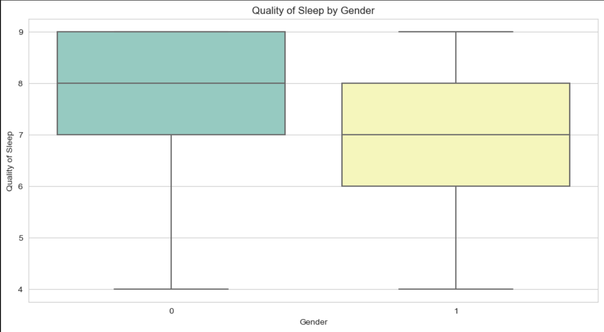
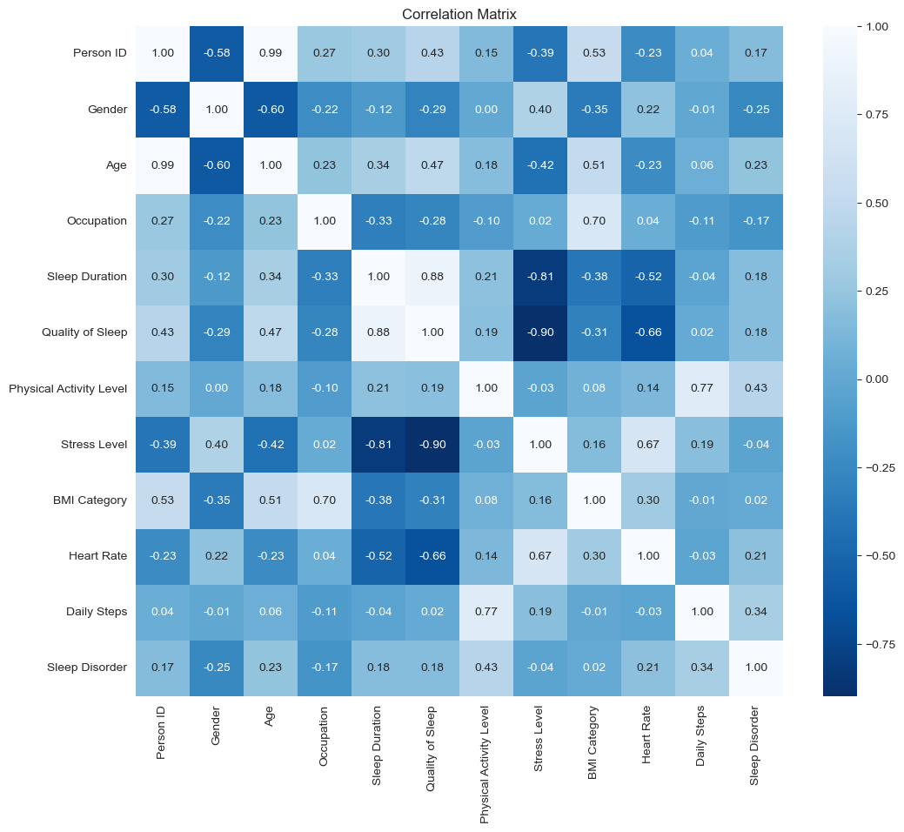

# Introduction
🛌 Sleep Quality Prediction: In this project, we explore the factors affecting sleep quality and build a predictive model. This comprehensive analysis includes data preprocessing, exploratory data analysis (EDA), and machine learning techniques to create a robust sleep quality prediction system.

🤔🔍 Looking for the Python scripts I used? Check them out here: [notebook folder](/notebook/)

### Aim of the Project:
1. Exploring and preprocessing our dataset.
2. Visualizing the relationships between features.
3. Training and evaluating a machine learning model for sleep quality prediction.
4. Predicting sleep quality based on user inputs.

# The Analysis
Each step in this project is designed to thoroughly investigate the dataset and develop a reliable sleep quality prediction model. Here's our approach to addressing each objective:

### 1. Data Preprocessing
* **Importing and Reading Dataset:** Initial loading and inspection of the dataset.
* **Null Value Check:** Confirming the absence of null values.
* **Categorical Transformation:** Converting categorical features into numerical values for model compatibility.

### 2. Exploratory Data Analysis (EDA)
* **Feature Analysis:** Analyzing the distribution and impact of various features on sleep quality.

* **Note:** This box plot shows that males (coded as 0) generally report higher sleep quality compared to females (coded as 1).

* **Note:** This box plot indicates that males (coded as 0) tend to have a longer sleep duration compared to females (coded as 1).

* **Note:** This heatmap illustrates the correlation between various features and sleep quality, highlighting significant relationships.
### ***Key Insights***

**Strong Positive Correlations:**

* **Sleep Duration and Quality of Sleep (0.88):** Indicates that higher sleep duration is strongly associated with better quality of sleep.
* **Physical Activity Level and Daily Steps (0.77):** Shows that higher physical activity levels correspond to more daily steps.

### 3. Machine Learning Model
* **Data Splitting:** Dividing the dataset into training and testing sets.
* **Model Training:** Training a RandomForestClassifier model to predict sleep quality.
* **Model Evaluation:** Assessing the model's performance using accuracy, precision, recall, and F1-score.

| Metric             | Training Set   | Testing Set    |
|--------------------|----------------|----------------|
| Accuracy           | 0.95           | 0.93           |
| Precision          | 0.94           | 0.92           |
| Recall             | 0.95           | 0.93           |
| F1-Score           | 0.94           | 0.92           |

### 4. Prediction
* **User Inputs:** Collecting and validating user inputs for prediction.
  
_e.g._

| Features            | Values     |
|---------------------|------------|
| Age                 | 30         |
| Gender              | Male       |
| Occupation          | Engineer   |
| Sleep Duration      | 7.0        |
| Physical Activity   | 50         |
| Stress Level        | 5          |
| BMI Category        | Normal     |
| Heart Rate          | 70         |
| Daily Steps         | 5000       |
| Sleep Disorder      | None       |

**Prediction: High Quality Sleep**

___

## 💡 ___Key Insights___
### Data Preprocessing
- **No Null Values:** The dataset is clean with no missing values.
- **Categorical to Numerical Transformation:** Successful conversion of categorical features for better analysis.

### Exploratory Data Analysis
- **Feature Analysis:** Identified significant features affecting sleep quality.
- **Feature Correlation:** The table identified significant correlations between certain features and sleep quality.

### Machine Learning Model
- **Training and Testing:** The RandomForestClassifier model showed promising results in predicting sleep quality.
- **Performance Metrics:** The model achieved high accuracy, precision, recall, and F1-score, indicating robust performance.

## 🏁 __Conclusion__
The analysis and model development indicate that the dataset can be effectively used to predict sleep quality. The RandomForestClassifier model demonstrates reliable performance, making it a valuable tool for predicting sleep quality based on various factors.

___
# Summary
This project has enhanced my skills in data preprocessing, exploratory data analysis, and machine learning model development to address the critical issue of sleep quality prediction:

* __🔍 Data Exploration:__ Detailed analysis of factors affecting sleep quality.
* __🤖 Machine Learning:__ Developed a classification model that accurately predicts sleep quality.
* __📊 Statistical Validation:__ Employed rigorous metrics to validate the model's performance, ensuring reliable predictions.

Leveraging Python for data processing and analysis, and visualization tools like Streamlit, this project provides a comprehensive solution for predicting sleep quality. 🛌
